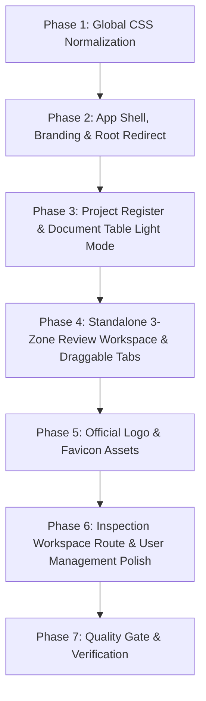

# Reksolindo Frontend Revamp Execution Plan

> **Role**: Lead Frontend Architect (Next.js 15 / Tailwind CSS / Radix UI / TypeScript)  
> **Brand Target**: Reksolindo – Clean Corporate White/Slate (Light Mode)  
> **Target Form Factor**: 14-Inch Display (1366x768 / 1080p) zero-scroll split review workspace  

---

## 1. Executive Summary & Core Objectives

1. **Strict Light Mode**:
   - Establish a clean, professional corporate palette based on white and slate (`#ffffff`, `#f8fafc`, `#f1f5f9`, `#e2e8f0`, `#0f172a`, `#334155`, `#64748b`, `#2563eb`).
   - Purge all forced dark mode styles (`bg-slate-950`, `bg-slate-900`, `border-slate-800`, `:root[data-theme="dark"]`).
   - Deprecate legacy `.rq-*` classes in favor of modern, maintainable Tailwind utility classes.
2. **Rebranding to "Reksolindo" & Brand Identity**:
   - Rebrand application name to "Reksolindo" across layouts, metadata, headers, and app shell.
   - Official Reksolindo swirl wave logo installed as `/reksolindo-logo.png`, app icon `/icon.png`, Apple icon `/apple-icon.png`, and `/favicon.ico`.
3. **Bilingual Navigation ("EN / ID")**:
   - Simplify the language toggle to a concise, elegant segmented control displaying strictly `EN / ID`.
4. **Navigation & Routing**:
   - Root route `/` immediately redirects to `/projects`.
   - Dedicated Inspection Workspace route at `/documents` hosting global document register, status telemetry, and live SSE extraction monitor.
   - App shell navigation features:
     - "Projects" (`/projects`)
     - "Inspection Workspace" (`/documents`)
     - "Manage Users" (`/admin/users`, visible only to `LEAD_ENGINEER` / `SUPERUSER`).
5. **Standalone 3-Zone Review Workspace (14-Inch Screen Optimization)**:
   - Zero-scroll outer boundary (`fixed inset-0 h-screen w-screen overflow-hidden bg-slate-100 flex flex-col`).
   - **Zone 1 (Top Bar)**: Fixed 48px height (`h-12 shrink-0 bg-white border-b border-slate-200`).
   - **Zone 2 (Split Viewer)**: Occupies `flex-1 min-h-0 overflow-hidden flex`.
     - Left: Annotated Canvas / Native PDF viewer (`flex-1 bg-slate-200/50 border-r border-slate-200`). Coordinate math and PDF canvas rendering preserved with 100% fidelity.
     - Right: Issues and findings curation panel (`w-[440px] xl:w-[500px] bg-white border-l border-slate-200`).
     - **Horizontally Scrollable / Draggable Issue Tabs**:
       - Category tabs (`Layout & Format`, `Budinski Compliance`, `Standards Audit`, `Language & Typos`) with `shrink-0` to prevent overlapping/clipping.
       - Smooth horizontal drag-to-scroll gesture (pointer down / move / up) plus left/right navigation arrow buttons so tabs can be dragged and scrolled cleanly.
   - **Zone 3 (Action Footer)**: Fixed 48px height (`h-12 shrink-0 bg-white border-t border-slate-200`).
6. **User Management & Role Clarity**:
   - `/admin/users` revamped with generous header spacing separating Access Control title, description, and "Tambah User Baru" button.
   - High-contrast bright blue badge (`bg-blue-100 text-blue-700 ring-1 ring-blue-600/30`) for the Engineer role to prevent blending into the table background.

---

## 2. Implementation Architecture & Phasing

### Phase 1: Global CSS Normalization (`globals.css`)
- Remove legacy `.rq-*` selectors and obsolete dark-mode `:root[data-theme="dark"]` rules.
- Define pure Light Mode semantic tokens:
  - `--canvas`: `#f8fafc`
  - `--surface` / `--panel`: `#ffffff`
  - `--panel-raised`: `#f1f5f9`
  - `--line`: `#e2e8f0`
  - `--text`: `#0f172a`
  - `--primary`: `#2563eb`
- Keep vital animation keyframes (`live-pulse`, `loading-spinner`, `processing-sheen`).

### Phase 2: Shell, Branding & Routing
- `frontend/src/app/page.tsx`: Server redirect to `/projects`.
- `frontend/src/app/layout.tsx`: Update metadata title to "Reksolindo Docs QA" and description to "Engineering Document Inspection & QA Platform"; configured favicon, icon, and apple-icon.
- `frontend/src/components/layout/app-shell.tsx`:
  - Reksolindo branding with official swirl logo mark.
  - Simplified `EN / ID` toggle button.
  - Light corporate navbar and profile dropdown.
- `frontend/src/components/layout/language-toggle.tsx`: Modern `EN / ID` pill toggle.

### Phase 3: Project Dashboard & Document Table
- `frontend/src/app/projects/page.tsx`: Clean Tailwind corporate layout, cards, and modal.
- `frontend/src/app/projects/[id]/page.tsx`: Light mode breadcrumbs, header, and action bar.
- `frontend/src/components/project/project-card.tsx`: Crisp corporate card styling.
- `frontend/src/components/project/project-document-table.tsx`: Clean table with light headers, badges, filters, and assignment selectors.

### Phase 4: 3-Zone Review Workspace & Horizontally Draggable Tabs
- `frontend/src/components/review/review-workspace-view.tsx`: Light 3-zone frame (`fixed inset-0 h-screen w-screen overflow-hidden flex flex-col bg-slate-100`).
- `frontend/src/components/review/split-screen-viewer.tsx`: Clean light split panes with embedded mode support.
- `frontend/src/components/review/issue-panel.tsx`:
  - Horizontally draggable and scrollable tab strip with mouse drag navigation and chevron scroll controls.
  - `shrink-0 whitespace-nowrap` on each tab item so tabs never overlap.
- `frontend/src/components/review/issue-card.tsx`: Corporate light finding cards with crisp severity badges.

### Phase 5: Official Logo & Favicon Assets
- Official swirl wave emblem placed in:
  - `frontend/public/reksolindo-logo.png`
  - `frontend/public/logo.png`
  - `frontend/public/icon.png`
  - `frontend/public/favicon.ico`
  - `frontend/src/app/icon.png`
  - `frontend/src/app/apple-icon.png`
  - `frontend/src/app/favicon.ico`
- `ReksolindoLogo` component updated to render official PNG logo mark with dark/light text variants.

### Phase 6: Inspection Workspace Route & User Management Polish
- `frontend/src/app/documents/page.tsx`: Created page rendering `<Dashboard />` (Material Document Control / Inspection Workspace).
- `frontend/src/components/layout/app-shell.tsx`: Linked "Inspection Workspace" to `/documents` with active state tracking.
- `frontend/src/components/document/dashboard.tsx` & `document-list.tsx`: Revamped to modern Tailwind Light Mode styling.
- `frontend/src/app/admin/users/page.tsx`: Refactored header layout with generous spacing between title, description, and "Tambah User Baru" button.
- `frontend/src/components/admin/user-table.tsx`: Replaced unstyled role badge with a bright blue badge (`bg-blue-100 text-blue-700 ring-1 ring-blue-600/30`) for high visibility.

### Phase 7: Verification & Quality Gate
- `tsc --noEmit` (`npm run typecheck`): 0 errors.
- `vitest run` (`npm test`): All test suites passing.
- `next build` (`npm run build`): All static and dynamic routes compiled successfully with Turbopack.
- Rebuilt Docker frontend service with `docker compose build frontend; docker compose up -d frontend`.

---

## 3. Preservation & Security Guardrails
- **Immutable Backend Files**: Zero changes made to `backend/services/export.py`, `backend/services/docx_styler.py`, `backend/services/report_synthesizer.py`, `backend/services/budinski_evaluator.py`, etc.
- **Canvas Coordinate Math Fidelity**: Zero modifications to coordinate mapping math in `pdf-canvas-viewer.tsx` or `highlight-overlay.tsx`.
